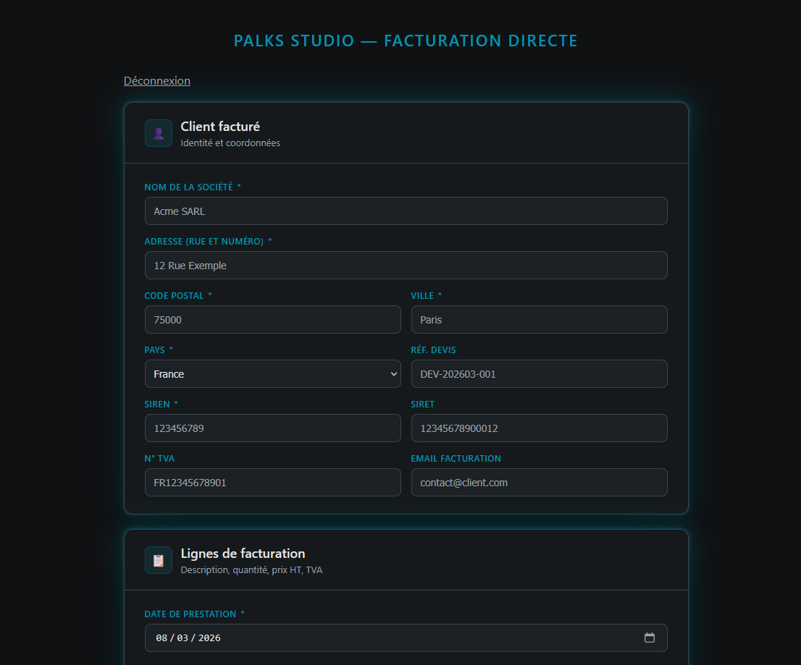

<p align="center">
  
</p>


> 🇫🇷 Français | [🇬🇧 English](./README.md)


<p align="center">
  <a href="https://palks-studio.com">
    
  </a>
</p>


# Moteur de facturation directe (PHP + Dompdf + Factur-X)

> Moteur de facturation orienté sécurité et sorties déterministes.

Moteur léger et déterministe de génération de factures électroniques :  

- Réception des données via formulaire HTML (POST)  
- Génération du PDF avec Dompdf  
- Génération du XML Factur-X  
- Injection du XML dans le PDF (PDF Factur-X)  
- Archivage structuré par client et par période  
- Génération d’un fichier de traçabilité (`.meta.json`)  
- Envoi email optionnel de la facture

Le projet privilégie :  

- simplicité  
- autonomie (sans dépendances externes critiques)  
- sorties déterministes  
- traçabilité complète  
- architecture lisible

---

## Fonctionnalités

- Création automatique du client (anti-doublon par identifiant)  
- Numérotation de facture séquentielle annuelle  
- Support multi-lignes  
- Gestion multi-taux de TVA  
- Génération Factur-X (XML + injection PDF)  
- Pré-génération de la facture acquittée  
- Métadonnées de traçabilité (hash SHA-256)  
- Envoi email optionnel  
- Journalisation technique  
- Validation manuelle des paiements avec traçabilité

### Validation des paiements

Une interface sécurisée permet de :  

- visualiser les factures en attente  
- marquer une facture comme payée  
- déplacer la facture acquittée  
- mettre à jour les métadonnées  
- alimenter le journal des recettes

L’accès est protégé par authentification.

---

### Recherche client

Un endpoint interne permet la recherche d’un client existant  
à partir d’un identifiant métier (SIREN, SIRET, TVA ou email).

Objectifs :  

- éviter les doublons de création client  
- préremplir les informations côté interface  
- accélérer la saisie de factures

L’accès à cet endpoint est protégé par session.

---

## Structure du projet

```
automation/
│
├── engine/
│   ├── build_facturx_xml.php             → Génération du XML Factur-X
│   ├── inject_facturx.py                 → Injection du XML Factur-X dans le PDF
│   ├── go.php                            → Moteur d’automatisation BATCH pour la facturation clients
│   ├── alerts.php                        → Gestion des alertes et notifications d’exécution
│   ├── mailer.php                        → Envoi des emails de notification batch
│   └── templates/                        → Template de factures clients
│
├── tmp/                                  → Fichiers temporaires du moteur (non persistants)
├── counters/                             → Compteurs séquentiels (numérotation des factures)
├── logs/                                 → Journaux techniques applicatifs
├── vendor/                               → Dépendances PHP
├── clients/                              → Configuration des clients finaux
├── data/
│   ├── invoices/                         → Factures émises
│   ├── acquittee/                        → Factures acquittées
│   └── tmp_facturx/                      → Fichiers temporaires Factur-X
│ 
│── app.py                                → Point d’entrée applicatif Python
├── passenger_wsgi.py                     → Passerelle WSGI pour Phusion Passenger
│── purge_logs.php                        → Nettoyage périodique des journaux
│
├── LICENCE.md                            → Conditions d’utilisation et cadre légal (FR)
├── LICENSE.md                            → Terms of use and legal Framework (EN)
│ 
├── docs/
│   ├── GUIDE_EXPLOITATION.md             → Guide d’exploitation du moteur Automation Batch (FR)
│   ├── OPERATIONS_GUIDE.md               → Batch Automation operations guide (EN)
│   ├── SECURITY_FR.md                    → Modèle de sécurité (FR)
│   ├── SECURITY.md                       → Security model and hardening guidelines (EN)
│   ├── NOTE_INTERNE_AUTOMATION_BATCH.md  → Note interne - Cadrage, Gouvernance et Structuration du Projet Automation Batch (FR)
│   ├── INTERNAL_NOTE_AUTOMATION_BATCH.md → Internal note — project structuring (EN)
│   ├── README_FR.md                      → Documentation générale du système (FR)
│   └── README.md                         → General system documentation (EN)
│
└── web/
    ├── client-lookup.php                 → Endpoint sécurisé de recherche client
    ├── facture-directe.php               → Interface sécurisée de création de facture
    ├── go.php                            → Endpoint sécurisé de génération de facture
    └── mark_paid.php                     → Interface sécurisée de validation des paiements
```


---

## Flux de fonctionnement

1. Le formulaire envoie les données en POST vers `go.php`  
2. Vérification de la session  
3. Validation minimale des données  
4. Résolution ou création du client  
5. Attribution du numéro de facture  
6. Génération du XML Factur-X  
7. Génération du PDF via Dompdf  
8. Injection Factur-X via script Python  
9. Écriture du fichier `.meta.json`  
10. (Optionnel) envoi email  
11. Téléchargement du PDF

---

## Prérequis

- PHP 8+  
- Extension `mbstring`  
- Extension `iconv`  
- Dompdf  
- Python 3 (pour l’injection Factur-X)  
- Accès écriture aux dossiers de données

---

## Installation (résumé)

1. Installer les dépendances PHP (Dompdf)  
2. Placer le projet dans un dossier non public si possible  
3. Vérifier les droits d’écriture sur :  
   - `data/`  
   - `clients/`  
   - `logs/`  
   - `counters/`  
4. Configurer le script d’injection Factur-X  
5. Connecter le formulaire HTML au endpoint `go.php`

---

## Sécurité

Le moteur intègre plusieurs protections :  

- accès conditionné par session  
- validation serveur des champs critiques  
- numérotation protégée par verrou fichier  
- écriture atomique des fichiers  
- journalisation technique  
- détection fiable du succès Factur-X  
- sessions PHP sécurisées (HttpOnly, Secure, SameSite)  
- limitation basique des tentatives de connexion  
- en-têtes HTTP défensifs  
- séparation des secrets hors dépôt

### Recommandations production

- placer le projet hors web root  
- protéger les endpoints sensibles  
- restreindre les permissions filesystem  
- surveiller les logs  

---

## Métadonnées de traçabilité

Chaque facture génère :  

```
ALT-XXXX.meta.json
```


Contenant notamment :  

- numéro de facture  
- client_id  
- date de génération  
- statut Factur-X  
- totaux HT/TVA/TTC  
- hash SHA-256 du PDF

Objectif : auditabilité et intégrité.

---

## Statut

Projet utilisé en production dans un contexte de facturation automatisée.

---

© Palks Studio — voir LICENSE.md  
- https://palks-studio.com